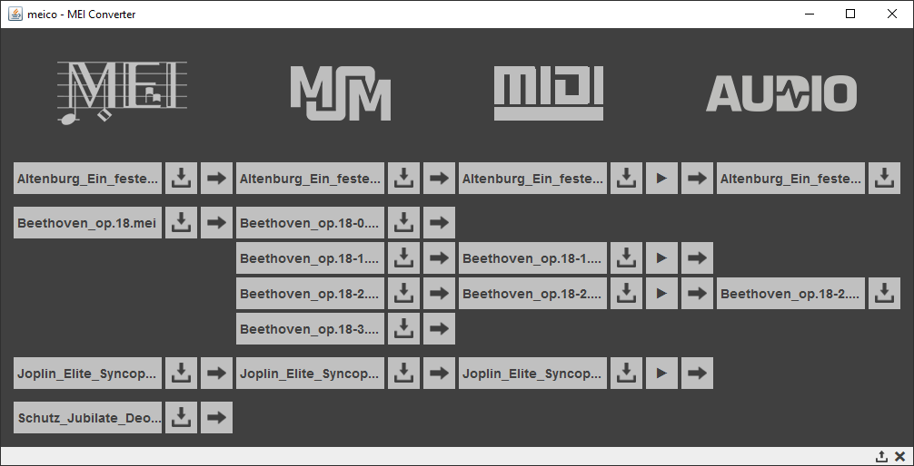

# meico: MEI Converter

Author: Axel Berndt 
MEI support: Benjamin W. Bohl 
[Center of Music and Film Informatics](http://www.zemfi.de/), Detmold

Meico is a converter framework for MEI files. Even though MEI is a quasi-standard for digital music editions, there is few software support for it. If you want to listen to the music in your MEI file, you need a MIDI or audio export. If you want to process the musical data (e.g., for Music Information Retrieval), there are many better suited formats and representations than MEI. With meico we address these issues. Meico implements methods to convert MEI data into the MSM (Musical Sequence Markup) format, an intermediate format that we defined for further use in other projects. From MSM, the MIDI export and audio rendering are quite straight forward. Currently, meico is a beta release. The following features are implemented:

- MEI to MSM conversion (with variable time resolution in pulses per quarter, ppq)
- MSM to MIDI conversion
- MIDI to audio conversion
- MEI processing functions (validation, xml:id generation, resolution of elements with copyof attribute)
- MSM processing functions (remove rest elements from the score)
- an instrument dictionary that uses several string matching algorithms to map staff names to MIDI program change numbers
- basic MIDI playback
- two standalone modes (command line mode, window mode).

There are several features open, though. Currently, meico ignores any MEI data that is concerned with expressive performance (tempo, dynamics, articulation, ornamentation). Repetitions are not resolved. Several MEI elements and attributes are not supported so far (e.g. meterSigGrp, uneume, lyrics). The MEI file must be unambiguous, i.e., it should not contain any variants (app, choice etc.). A tool to resolve ambiguity is under construction and will soon be published. We are also developing a schematron rule set to give detailed feedback on the supported and unsupported MEI elements when an MEI file is loaded into meico.

###How to use meico?

Meico can be used in several different ways. The jar file (see the GitHub release page) is a standalone runnable Java program. We have tested it under Windows, Mac OS and Linux. The only prerequisite is that you have a Java 1.6 (or higher) Runtime Environment installed on your computer. 

Starting the standalone jar without any command line options will start the windowed gui mode of meico. Simply drag your MEI, MSM, MIDI, and Wave files into the window. You can find context information on each interface element in the tooltips and statusbar. There are several additional functions accessible via right click. If you have several mdivs in your MEI document you will get an individual MSM instance for each movement. Conversion from MIDI to audio may take some time when it is a long piece. We have not built in a progress display, so far. Just be patient until the conversion button changes its color back and the audio data appears.

The command line mode expects the following command line options:
- `[-?]` or `[--help]`: for this command line help text. If you use this, any other arguments are skipped.
- `[-v]` or `[--validate]`: to activate validation of mei files loaded
- `[-a]` or `[--add-ids]`: to add xml:ids to note, rest and chord elements in mei, as far as they do not have an id; meico will output a revised mei file
- `[-r]` or `[--resolve-copy-ofs]`: mei elements with a `copyOf` attribute are resolved into selfcontained elements with an own `xml:id`; meico will output a revised mei file
- `[-m]` or `[--msm]`: converts mei to msm; meico will write an msm file to the path of the mei
- `[-i]` or `[--midi]`: converts mei to msm to midi; meico will output a midi file to the path of the mei
- `[-w]` or `[--wav]`: converts mei (to midi, internally) to wav; meico will output a wave file to the path of the mei
- `[-p]` or `[--no-program-changes]`: call this to suppress the generation of program change events in midi
- `[-c]` or `[--dont-use-channel-10]`: the flag says whether channel 10 (midi drum channel) shall be used or not; it is already done at mei-to-msm convertion, because the msm should align with the midi file later on
- `[-t argument]` or `[--tempo argument]`: this sets the tempo of the midi file; the argument must be a floating point number; if this is not used the tempo is always 120 bpm
- `[-d]` or `[--debug]`: to write debug versions of mei and msm
- The final argument should always be a path to a valid MEI file (e.g., `"C:\myMeiCollection\test.mei"`); always in quotes! This is the only mandatory argument if you want to convert something.

The third way of using meico is as a Java programming library. Its `Mei`, `Msm`, `Midi`, and `Audio` classes are the most important to work with. Class `meico.app.MeiCoApp` demonstrates the use of meico (method `commandLineMode()` is best suited as tutorial). Unfortunately, we have no API documentation, yet. But the source files are extensively commented and should suffice as makeshift.

###License information

Meico makes use of the following third party libraries:
- XOM v1.2.10 by Elliotte Rusty Harold, GNU Lesser General Public License (LGPL) version 2.1.
- Java-String-Similarity v0.13 by Thibault Debatty, MIT license.
- MigLayout v4.0 by Mikael Grev (MiG InfoCom AB), BSD and GPL license.
- parts of GNU Classpath by Free Software Foundation, Inc., GNU GPL license.
- the FileDrop class v1.1.1 by Robert Harder, Nathan Blomquist and Joshua Gerth, Public Domain release.
- Jing v20091111 by James Clark (Thai Open Source Software Center Ltd), see `copying.txt` provided in file `jing-20091111.jar`.
- MEI Common Music Notation Schema (`mei-CMN.rng`), Educational Community License (ECL) 2.0.
- parts of `MidiToWavRenderer.java`, an add-on to the JFugue library, LGPL license.

We publish meico under GNU LGPL version 3. Meico development is part of the ZenMEM project which is funded by the German Federal Ministry of Education and Research (funding code 01UG1414A–C).
If you use meico in your project make sure that you do not conflict with any of the above licenses.

